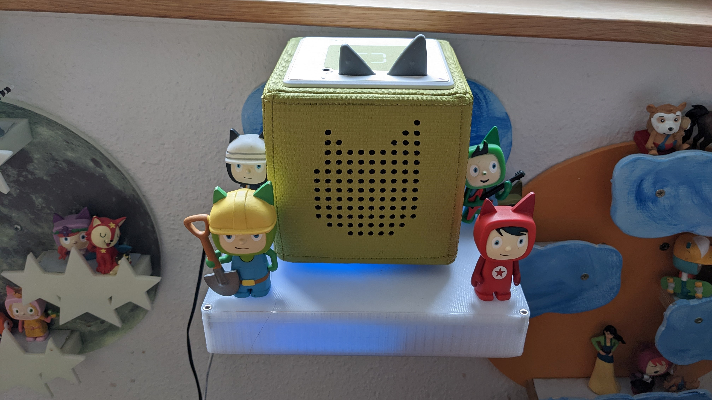
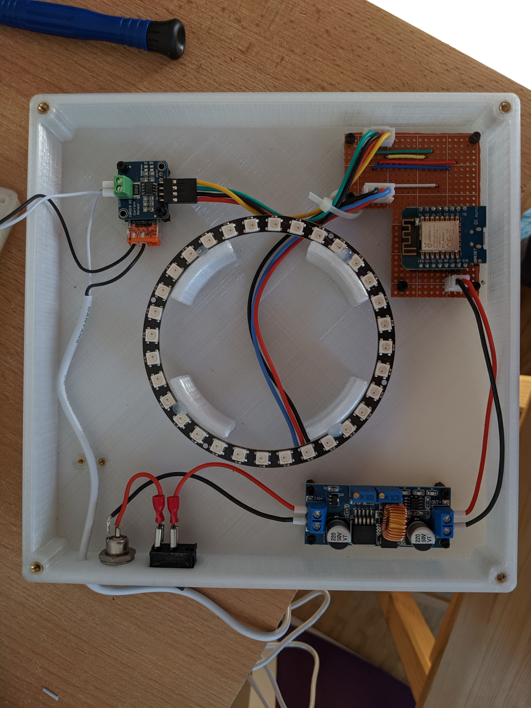
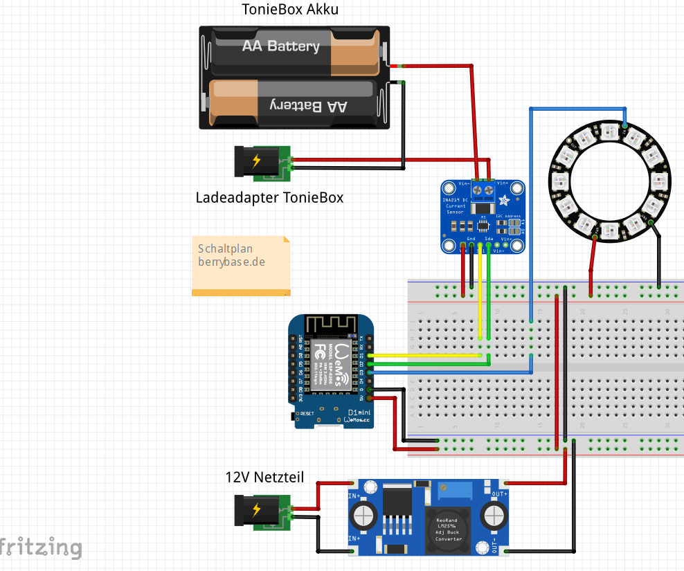

# TonieBox_Charger

This is a project, to modify the simple TonieBox-Charger with some more "kids fantasy"

## Construction
This project is very simple. You need some parts from berrybase.de (see ) and you need to print some parts.
The wiring and the layout for the D1 Mini is in two different folders, see folder 3D-Files.
Version 1 was without any CNC-Shields, so wiring and solding all pathes by your own.

Version 2 is my latest version, with a modern CNC-layout from Target3000!. This can be use to create an own CNC-File, cause Target3000! is free for use.
The basic for wiring is in both version the same. 
Keep in mind you need the right case for each version. Both versions have a wollmount, if wanted.
The top for the TonieBox-Charger is for both versions the same.

## Code
The code is written in Visual Studio Code and PlatformIO. Modyfing is very simple and can be done very easy.

## Berrybase.de
All parts can be found on berrybase.de, where also the main blog articel can be found.
